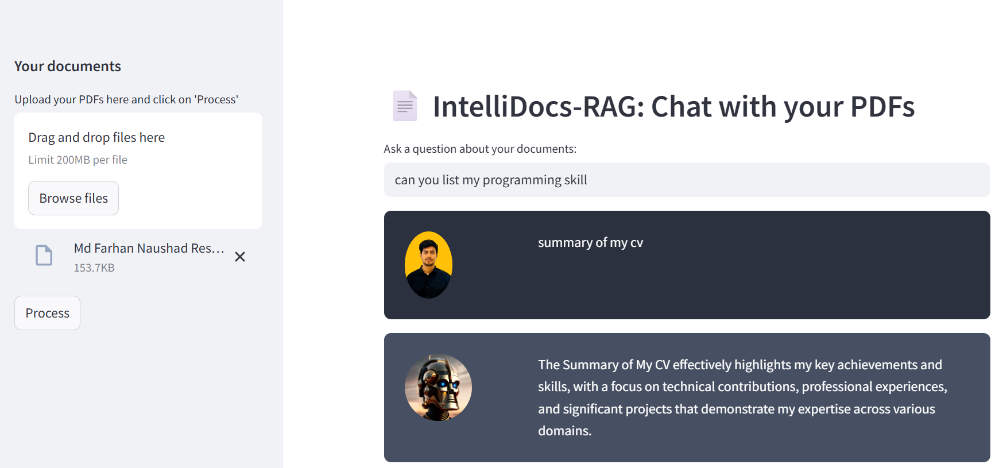
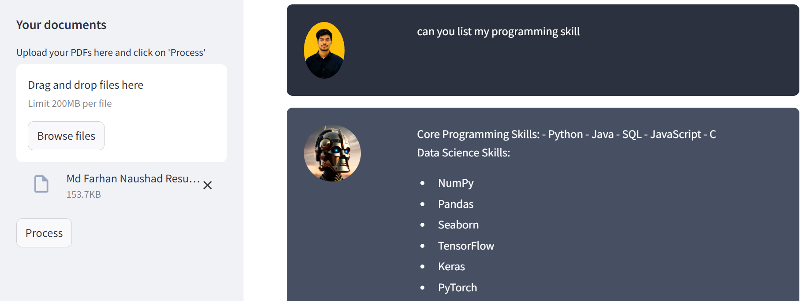

# 🤖 IntelliDocs-RAG: Local PDF Chatbot using RAG & Offline LLM




**IntelliDocs-RAG** is a powerful, privacy-focused chatbot that allows users to chat with their own PDF documents — completely offline. It uses a **Retrieval-Augmented Generation (RAG)** pipeline powered by **local LLMs via Ollama** to generate fast and context-aware answers.

Whether you're a student, researcher, or professional, IntelliDocs-RAG gives you instant insights from multiple PDFs — without relying on the cloud.

---

## 🧠 Real-World Use Case

> **Imagine you're in a remote location with no internet access**. You have several PDF research papers, manuals, or reports — and you need quick answers without manually reading through them.
>
> With **IntelliDocs-RAG**, just upload your PDFs and ask:
>
> - “Summarize the methodology section of paper 2.”
> - “Which papers mention 'transformer architecture'?”
>
> The system responds instantly — powered entirely by **offline AI**, keeping your documents private and secure.

---

## 🔒 Why Offline Matters

Most modern AI apps rely on internet-based APIs (OpenAI, Google, etc.), which pose issues like:

- ❌ Internet dependency
- ❌ Data privacy concerns
- ❌ Costly API calls and rate limits

**IntelliDocs-RAG** provides a solution with:

✅ **Offline LLM via Ollama**  
✅ **Local document embeddings**  
✅ **No cloud or third-party dependency**  
✅ **Fully open-source and customizable**

---

## 💻 Tech Stack Overview

| Component         | Technology                             | Purpose                                  |
|------------------|-----------------------------------------|------------------------------------------|
| **UI**            | Streamlit                               | File upload, chatbot interface           |
| **PDF Reader**    | PyPDF2                                  | Extracts text from PDFs                  |
| **Chunking**      | LangChain CharacterTextSplitter         | Maintains context in small chunks        |
| **Embeddings**    | OllamaEmbeddings (`deepseek-r1:1.5b`)   | Understands document semantics           |
| **Vector DB**     | FAISS                                   | Fast similarity search among documents   |
| **LLM Backend**   | Ollama + Local Model (`deepseek-r1`)    | Generates context-aware answers locally  |
| **Prompt Engine** | LangChain PromptTemplate                | Constructs question-answering pipeline   |

---

## 🗂️ Project Structure

```
IntelliDocs-RAG/
├── IntelliDocs_RAG.py        # Main Streamlit app
├── htmlTemplates.py          # Custom HTML styling for UI
├── requirements.txt          # Required Python packages
├── demo1.png                 # UI screenshot 1
├── demo2.png                 # UI screenshot 2
├── photo.jpg                 # Optional logo or branding image
```

---

## ⚙️ How to Run the App Locally

### 1. Clone the repository
```bash
git clone https://github.com/farhannaushad08/IntelliDocs-RAG.git
cd IntelliDocs-RAG
```

### 2. Install dependencies
```bash
pip install -r requirements.txt
```

### 3. Make sure Ollama is installed and running
Install Ollama from: [https://ollama.com](https://ollama.com)

Download the LLM model used:
```bash
ollama pull deepseek-r1:1.5b
```

### 4. Run the Streamlit app
```bash
streamlit run IntelliDocs_RAG.py
```


## 🌟 Future Improvements

- 🔍 Support for multi-language PDFs
- 📚 Summarization & citation features
- 🧠 Plug-in architecture for other file formats (DOCX, TXT)
- 🌐 Optional web deployment with user authentication


---

## 🙌 Final Note

**IntelliDocs-RAG** is more than just a PDF chatbot — it's a step toward democratizing access to intelligent document understanding, even in **offline or resource-constrained environments**. Whether you're a student in a remote area, a researcher working with sensitive data, or a privacy-conscious developer, this tool empowers you with AI — on your own terms.


---

## 📜 License

This project is licensed under the MIT License. See `LICENSE` file for details.

---
